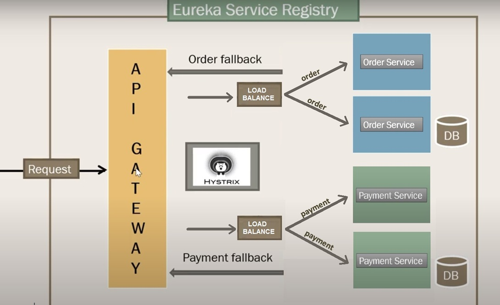

# SpringCloud

This repository is a case study of microservice spring using spring cloud. 

In project there are two microservices(order and payment).

The tecnology apply are:

  Spring boot
  Spring Data jpa
  Sprig Web
  Lombok
  H2 Database
  
  Spring cloud Eureka 
  Spring cloud Load Balance
  Spring cloud gateway
  Spring cloud hystrix
  Spring cloud hystrix dashboard
  
<h1 align="center">
    
</h1>
  
  
